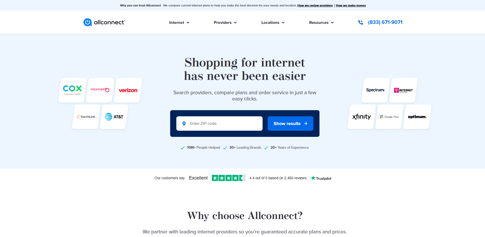
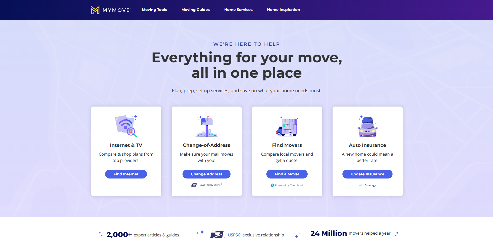

  

 

  
  
  

 

## 🎓 Education

<table>
<tr>
<td width="50%">

### 🎓 University of California, Berkeley
*Bachelor's degree, Computer Science*  
*Aug 2009 - May 2013*

**Key Focus Areas:**
- Computer Science fundamentals
- Software engineering principles
- Data structures and algorithms
- System design and architecture

</td>
<td width="50%">

### 🏫 Downtown Magnets High School
*High School Diploma, Software Engineering Pathway*  
*Aug 2005 - Jun 2009*

**Key Focus Areas:**
- Software engineering foundation
- Programming fundamentals
- Problem-solving methodologies
- Early development experience

</td>
</tr>
</table>

## 🌟 Portfolio Highlights

<table>
<tr>
<td width="50%">

### 🏢 AllConnect.com
*Connecting consumers with essential home services*

**Key Features:**
- Comprehensive home services marketplace
- Advanced search and filtering capabilities
- Real-time pricing comparisons
- Seamless provider matching
- Mobile-first responsive design

*Modern, responsive design connecting consumers with essential home services*

</td>
<td width="50%">

### 🚚 MyMove.com
*Simplifying the moving process for millions*

**Key Features:**
- Comprehensive moving checklist system
- Local service provider directory
- Moving cost calculator
- Timeline management tools
- Personalized moving guides

*Intuitive user experience streamlining the moving process*

</td>
</tr>
</table>

## 💼 Professional Journey

### 🚀 **12+ Years of Frontend Excellence**

<table>
<tr>
<td align="center" width="33%">

**🏢 Red Ventures**  
*Jun 2024 - Present*

**Frontend Team Lead**
- Leading frontend direction for relocation and home-services guidance platform
- Focusing on smoother delivery, clearer user experience, and product growth
- Mentoring and growing talented frontend developers

</td>
<td align="center" width="33%">

**🏢 Red Ventures**  
*Apr 2023 - May 2024*

**Senior Full-Stack Engineer**
- Advanced full-stack development
- Cross-platform solutions
- Performance optimization

</td>
<td align="center" width="33%">

**🏢 Sumeru Inc**  
*Sep 2021 - Mar 2023*

**Senior Full-Stack & Mobile Engineer**
- Mobile-first development
- Full-stack architecture
- Team collaboration

</td>
</tr>
<tr>
<td align="center" width="33%">

**🏢 Sumeru Inc**  
*Mar 2019 - Aug 2021*

**Full-Stack & Mobile Engineer**
- Cross-platform development
- API design and implementation
- User experience optimization

</td>
<td align="center" width="33%">

**🏢 Goji Labs**  
*Jul 2016 - Feb 2019*

**Full-Stack & Mobile Developer**
- Mobile application development
- Backend integration
- Agile development practices

</td>
<td align="center" width="33%">

**🏢 Dogtown Media**  
*Jul 2013 - Jun 2016*

**Software Developer**
- Foundation in software development
- Web and mobile applications
- Client-focused solutions

</td>
</tr>
</table>

## 🛠️ Tech Stack & Expertise

### Frontend Technologies

### Styling & Design

### Backend & Full-Stack

### Databases

### Mobile Development

### Build Tools & Bundlers

### Testing

### Cloud & DevOps

### Version Control & CI/CD

### APIs & Integration

### Performance & Monitoring

### Design & Prototyping

## 📊 GitHub Analytics

  
  

## 🌟 Let's Connect!

  
  

---

  
  

  <i>Building the future of web experiences, one line of code at a time.</i>

